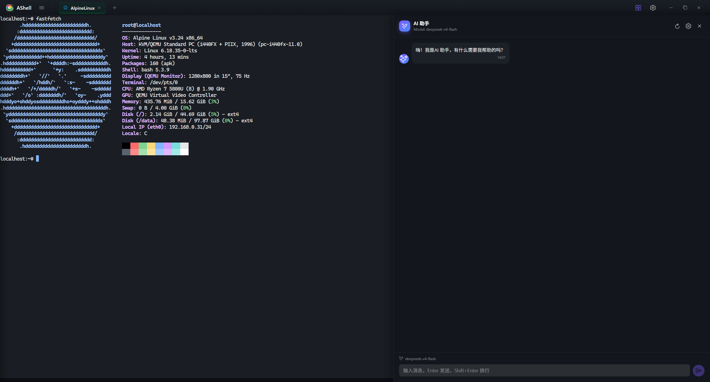

# AShell

[English](./README.en.md) | 简体中文

> 一个现代化、跨平台的终端 / SSH 客户端 —— 把本地终端、远程 SSH、SFTP、主机监控、端口转发与 AI 助手整合到一个桌面应用里。

AShell 注重性能、隐私与可定制性。所有 SSH 凭证本地加密存储，AI 助手在你自己的机器上运行，密钥不离开你的设备。

---

## 功能特性

### 🖥 终端
- **跨平台**：macOS / Windows / Linux，覆盖 x86_64 与 ARM64。
- **多 Tab 多窗口**：Tab 拖拽重排、右键菜单（重连 / 断开 / 复制连接 / 新窗口 / 复制 SSH 地址 / 重命名 / 导出会话），跨窗口无缝操作。
- **本地终端**：Windows ConPTY / Unix forkpty，支持 PowerShell、cmd、Git Bash、Bash、Zsh、Fish。
- **远程 SSH**：PTY + 二进制安全帧透传，颜色控制码完整保留。
- **渲染加速**：WebGL 渲染 + 连字（ligatures）+ 网页链接可点 + Unicode 11 + 搜索 + 序列化。
- **进度条识别**：自动识别 `cargo` / `brew` / `wget` / `curl` / `git` / `rsync` / `docker` 等命令的文本进度，同步到任务栏与终端顶部。
- **可配置操作**：Ctrl + 滚轮调字号、鼠标右键 / 中键行为可配、Ctrl + F 搜索浮层。

### 📁 主机管理
- **无限层级目录树**：拖拽移动子树、级联删除、跨目录复制，按目录组织你的主机。
- **凭证加密**：密码 / 私钥用 AES-256-GCM 加密落盘，永不通过接口外泄。
- **主机元信息**：名称、地址、端口、用户名、图标、颜色、描述，自由归类。
- **可调宽侧面板**：边缘拖拽调宽，宽度持久化记忆。

### 📂 SFTP 文件管理
- **完整 CRUD**：列出（含属主 / 权限 / 时间戳）、新建目录 / 文件、删除、重命名、属性查看。
- **流式传输**：上传带进度与可取消、下载走原生"另存为"对话框、支持文件夹整传。
- **路径面包屑**：可点击 + 可编辑，快速跳转。
- **连接复用**：与终端共享同一 SSH 连接，无需重新认证。

### 📊 主机监控
- **实时资源**：CPU / 内存 / 交换 / 磁盘 / 累计网络字节，1.5s 节流轮询。
- **Top 5 进程**：兼容 procps 与 BusyBox。
- **网络流量**：纯 SVG 双线（rx/tx）环形缓冲图，网卡可切换。
- **磁盘折叠**：根挂载主显示，其余挂载点折叠收起。

### 🔌 端口转发
- **三种模式**：本地（`-L`）、远程（`-R`）、动态（`-D`）。
- **可视化规则表**：规则列表 + 流量 / 状态实时刷新。
- **图形化创建**：表单填空即可新增转发规则，无需手敲命令。

### 📡 广播输入
- **多 Tab 同步**：按键级实时转发到多个终端，目标 Tab 可勾选。
- **跨窗口支持**：源 Tab 可选、自动追加回车，跨窗口广播无障碍。

### 🤖 AI 助手
- **Claude 驱动**：每个终端会话独立 AI 进程，互不干扰。
- **执行过程可折叠**：工具调用与返回聚合成可折叠块，对话整洁可读。
- **破坏性操作确认**：执行前弹 y/n 确认条，敏感信息（SSH 会话凭证）不直接透露。
- **远程命令执行**：AI 自动复用当前 SSH 会话，在你授权后执行远程命令。
- **模型可配**：支持自定义 API Key、Base URL、模型名，兼容代理与自托管端点。

### 🎨 窗口与外观
- **透明度滑块**：实时调整窗口不透明度。
- **Acrylic 毛玻璃**：macOS / Windows 11 原生模糊效果。
- **背景壁纸**：独立透明度，壁纸与窗口透明分离。
- **系统字体枚举**：自动列出已安装字体，去重 + 字典序。
- **主题**：暗色 / 亮色，配色统一从主题变量派生。

### 🌐 国际化与启动
- **双语**：简体中文 / English 完整覆盖，UI 语言随选随切。
- **会话恢复**：记住上次的 Tab 列表，启动时骨架恢复。
- **默认 Shell**：可选 Auto / PowerShell / cmd / Git Bash / Bash / Zsh / Fish，启动自动打开本地终端。

---

## 下载安装

前往 [Releases](https://github.com/vcqr/ashell/releases) 下载对应平台的安装包：

| 平台 | 文件 |
|---|---|
| macOS (Apple Silicon) | `*.dmg` |
| macOS (Intel) | `*.dmg` |
| Windows x64 | `*.msi` / `*.exe` |
| Windows ARM64 | `*.msi` / `*.exe` |
| Linux x64 | `*.deb` / `*.rpm` / `*.AppImage` |
| Linux ARM64 | `*.deb` / `*.rpm` / `*.AppImage` |

---

## 许可证

MIT
